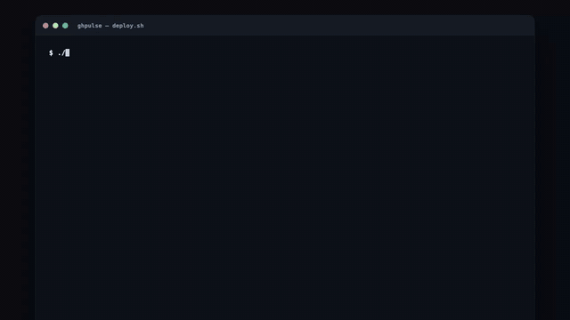

<div align="center">

# ⚡ ghpulse

### Your daily, local pulse on what developers are *actually* building.

**No feed. No paid influencers. No subscription. Just a terminal.**

[](#-quickstart)
[](#-talk-to-the-news)
[](#-quickstart)
[](#)
[](LICENSE)

<br/>



<sub>▶ <a href="assets/demo.mp4">Watch the full-quality video</a></sub>

</div>

---

## 🤔 Why

Every day I look around forums, GitHub discussions, social media and news to keep up with what other developers and companies are doing. Sometimes I just want to see what people are shipping for **context compression** or **caching** — but with all the paid content and clickbait like *"This git repo killed Nvidia"*, it's getting harder and harder to find the signal.

So I built a small program to scan GitHub, rank repos by the metrics I actually care about, and let me **talk to the results** with a small model running on my own laptop. No paid traffic, no paid LLM — I read what real builders are doing and draw my own conclusions.

---

## ✨ What it does

- 📈 **Scans thousands of repos** across the last **7 and 30 days** (last run tracked **14,498**).
- 🏆 **Ranks them six ways** — trending momentum, % star growth, stars gained, forks, commit activity, most-starred — with a **week / month** toggle.
- 🧠 **Talk to the news** — a Small Language Model runs **locally** so you can search the cohort and ask questions like *"which of these save context in agent sessions?"* — grounded on the actual repos.
- 📝 **One-line "what it does"** for every repo, so you skim the whole week in two minutes.
- 🔒 **Everything stays on your machine** — your GitHub token never leaves it, and nothing you ask leaves it either.
- 🧭 **Groups & filters** by topic (AI agents, LLM infra, context/RAG, security, dev-tools…).

---

## 📊 The metrics (~20)

| | Metric | What it tells you |
|---|---|---|
| ⭐ | **Stars** + **% change (week & month)** | popularity and how fast it's moving, up *or* down |
| 🚀 | **Momentum** | star velocity scored vs peers of similar size (small fast-risers beat big slow ones) |
| ✨ | **New stars** (week / month) | raw stars gained |
| 🍴 | **Forks** + **fork velocity** | how many people are building on it |
| 🔨 | **Commits (7d)** + **commit growth %** | how actively it's being worked on |
| 👀 | **Watchers** · 🐛 **Open issues** · 📦 **Last release** | engagement & maintenance signals |
| 🌱 | **Breakout score** | stars/day for brand-new repos |
| ⚠️ | **Riser flag** | warns when stars spike but forks/issues stay flat (possible gamed growth) |
| 💬 | **Social buzz** | mentions across Hacker News, Reddit, Lobsters |

<sub>See [the full list →](#-the-metrics-20)</sub>

---

## 🚀 Quickstart

```bash
git clone <your-fork-url> ghpulse && cd ghpulse
./deploy.sh
```

That's it. `deploy.sh` walks you through everything, step by step:

```
▸ Step 1/6 · Locating Python 3.12+
▸ Step 2/6 · Installing dependencies (virtualenv + ghpulse)
▸ Step 3/6 · Ollama — free local AI (downloads qwen2.5)
▸ Step 4/6 · GitHub token (asks you, with instructions)
▸ Step 5/6 · First scan (discover · last 7 + 30 days)   ⠹ scanning…
▸ Step 6/6 · Serving → http://localhost:8414
```

**No token to try it?** Run the offline demo:

```bash
./deploy.sh --demo
```

---

## ⚙️ How it works

1. **Install dependencies** into a local virtualenv.
2. **Download a small model** to run locally via [Ollama](https://ollama.com) (free — you can also point it at any Hugging Face GGUF).
3. **Auto-detect your GitHub token** from `~/.config/ghpulse/env` (it tells you how to make one if it's missing).
4. **Scan GitHub** — sharded search across the last 7 and 30 days, then snapshot stars/forks/commits and compute the metrics.
5. **Open a local web app** that connects the scanned data to the model, so you can **talk to it and search through it**.

---

## 🧠 Talk to the news

The Ask bar at the top runs a **local Small Language Model** (default `qwen2.5` via Ollama). Type a topic to search the tracked cohort instantly, hit **Search GitHub for more** for the live long tail, or ask a full question and get a grounded answer citing the actual repos.

> **You:** context saving
> **🧠 ghpulse:** For saving context in agent sessions, three here stand out — `context-engineering` (consistent, predictable context), `PRD-driven-context-engineering` (memory as infrastructure), and `context7` (pulls only the docs an agent needs). Start with context7 for the quickest win.

Prefer a hosted model? Set `GHPULSE_LLM=anthropic` + an `ANTHROPIC_API_KEY` and it uses Claude instead. Your call — the default costs nothing.

---

## 🔧 Configuration

Everything is env-configurable (put these in `~/.config/ghpulse/env`):

| Variable | Default | What it does |
|---|---|---|
| `GITHUB_TOKEN` | — | your GitHub token (public-read only; no write scopes needed) |
| `GHPULSE_LLM` | `ollama` | `ollama` · `anthropic` · `auto` · `off` |
| `GHPULSE_OLLAMA_MODEL` | `qwen2.5` | which local model to run |
| `GHPULSE_CLAUDE_MODEL` | `claude-sonnet-5` | model used when `GHPULSE_LLM=anthropic` |
| `GHPULSE_HOME` | `~/.ghpulse` | where the DB + rendered site live |

Watched languages and topics live in `src/ghpulse/config.py`.

---

## 🏗️ Under the hood

- **Python 3.11+**, SQLite (WAL), no server framework — just the stdlib.
- **GitHub REST search** (sharded to dodge the 1000-result cap) + **GraphQL** snapshots with ETag caching.
- **Ollama** for the local agentic model; **Claude** optional.
- **Static site** rendered with Jinja2 + a liquid-glass UI; a tiny stdlib control panel powers the Ask bar.
- **131 tests**, fully offline via a demo seed.

---

## 🤝 Contributing

It's early and the UI is intentionally rudimentary — I focused on function, and I'm not a designer. **Fork it, make it your own, or open a PR.** Ideas, metrics, and design help all welcome.

## 👤 Author

**Alek Carvalho**

- ✉️ [alemoraesc@me.com](mailto:alemoraesc@me.com)
- 💼 [LinkedIn](https://www.linkedin.com/in/alemoraesc/)
- 🐙 [GitHub](https://github.com/alemoraescarv)

## 📄 License

[MIT](LICENSE) © 2026 Alek Carvalho — do what you like with it.

<div align="center"><sub>Built on a treadmill, at an early-morning gym. 🏃</sub></div>
